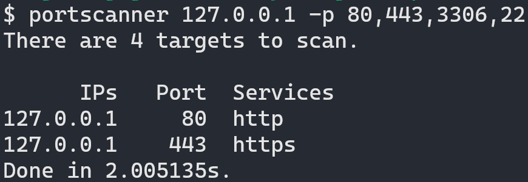

# Portscanner

## Example



## Help

```
Usage:
  portscanner [IP|CIDR] [flags]

Examples:
  portscanner 127.0.0.1 -p 80
  portscanner 127.0.0.1 -p 1~1023,1234
  portscanner 127.0.0.1/24 -p 22
                                   
Flags:                                   
  -h, --help          help for portscanner
  -p, --port string   (Required) Between 0 and 65535.
                      Use ',' or '~' to scan multiple ports. See above examples.
```

## TODO

- scan UDP port

